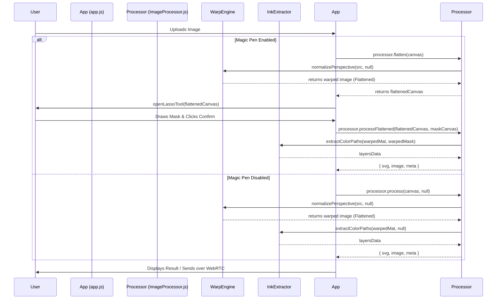

# Updated Urumi Vision Pipeline Flow

Here is a visualization of how the pipeline works now, reflecting the recent changes that introduced the pre-flattening step before the Lasso selection.

### Key Changes Breakdown:

1. **Two-Step Processing (When Magic Pen is On):**
   - The application now immediately isolates the ArUco marker detection and perspective warping (`normalizePerspective`) into its own step called `flatten()`.
   - The user interface waits for this to finish, and *then* displays the flattened canvas in the Lasso modal.
2. **Post-Lasso Processing:**
   - Once you finish your selection, the resulting mask perfectly aligns with the already-flattened image.
   - The app sends both of these to `processFlattened()`, which skips the warping step and goes straight into `extractColorPaths`.
3. **Legacy Fallback:**
   - If the Magic Pen is disabled, the standard `process()` method is still available. It internally just does everything in one go without stopping to ask for user input.
